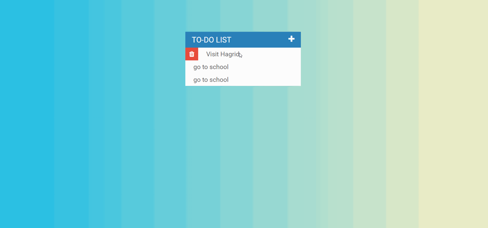

#  *to-do-list-project*

**to-do-list-project** is a web app used to record daily events by using css, javascript, jquery and bootstrap.

Submitted by: **Jie Lan**

webSite: https://jiejaylan.github.io/to-do-list-project/

## User Stories
* User can add and delete events.
* User can mark the event has been done.

## Video Walkthrough 

Here's a walkthrough of implemented user stories:

GIF created with [LiceCap](http://www.cockos.com/licecap/).

## License

    Copyright [Jie Lan] [name of copyright owner]

    Licensed under the Apache License, Version 2.0 (the "License");
    you may not use this file except in compliance with the License.
    You may obtain a copy of the License at

        http://www.apache.org/licenses/LICENSE-2.0

    Unless required by applicable law or agreed to in writing, software
    distributed under the License is distributed on an "AS IS" BASIS,
    WITHOUT WARRANTIES OR CONDITIONS OF ANY KIND, either express or implied.
    See the License for the specific language governing permissions and
    limitations under the License.
